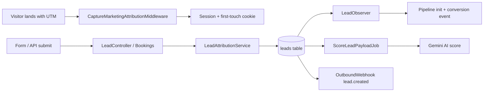
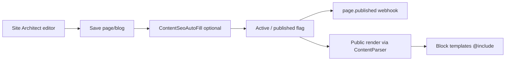
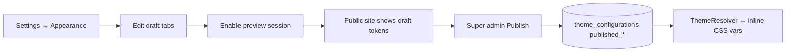
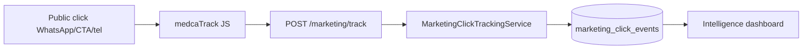
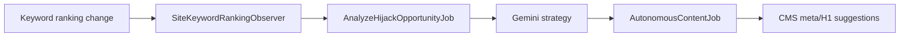
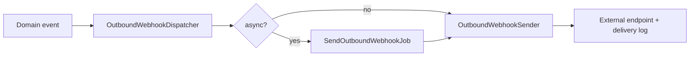

# Medca Healthcare / MarkOnMinds — Complete System Inventory Report

**Generated:** 2026-05-30  
**Stack:** Laravel 13 · PHP 8.5 · Livewire · Alpine · Blade · Tailwind · Vite  
**Repository:** `medcahealthcare`  
**Test status:** 303/303 passing · 991 assertions  
**Services:** 88 · **Migrations:** 73 · **Policies:** 16 · **Livewire:** 16

---

## 1. Executive Summary

Medca Health Care is a dual-shell healthcare marketing and operations platform:

| Shell | Audience | CSS namespace | Layout |
|-------|----------|---------------|--------|
| **Public** | Patients, caregivers, job seekers | `--medca-*` | `layouts/app.blade.php` |
| **Admin (MarkOnMinds)** | Staff, managers, marketers | `--mom-*` | `x-layouts.markonminds` |

The system spans **8 module-gated workspaces**, **22 Git-managed block templates**, **dynamic module builder**, **growth/competitor intelligence**, **marketing automation (Phase 11)**, and **theme management (Phase 8)**.

---

## 2. Features Inventory

### 2.1 Public Marketing Website

| Feature | Status | Notes |
|---------|--------|-------|
| CMS-driven home + static pages | ✅ | `CmsPageController`, block tokens |
| Services catalog + detail pages | ✅ | Hyper-local pincode scoping |
| Careers hub + job applications | ✅ | WhatsApp apply tracking |
| Blog publishing | ✅ | `/blog/{slug}` |
| Pincode / geolocation gate | ✅ | `PincodeModal` Livewire |
| Service reviews (moderated) | ✅ | Lead-verified eligibility |
| SEO: sitemaps, robots.txt | ✅ | Segment sitemaps |
| AEO: llm.txt, ai-discovery | ✅ | Growth module |
| GA4 + Meta pixel injection | ✅ | `tracking-head/body` |
| Theme tokens (runtime) | ✅ | Phase 8 — draft/preview/publish |
| Marketing click tracking | ✅ | Phase 11 — `medcaTrack()` |
| UTM / first-touch attribution | ✅ | Cookie + session middleware |

### 2.2 Site Architect (CMS)

| Feature | Status |
|---------|--------|
| Page editor with blocks | ✅ |
| Block Factory (22 templates) | ✅ |
| Git → DB block sync (`blocks:sync`) | ✅ |
| Blog management | ✅ |
| Navigation system (header/footer) | ✅ |
| Media library | ✅ |
| Page/blog preview + activity log | ✅ |
| SEO/AEO auto-fill (Gemini) | ✅ |
| Dynamic Module Builder | ✅ |
| Hijack content bridge (Growth) | ✅ |

### 2.3 Operations

| Feature | Status |
|---------|--------|
| Services CRUD + detail pages | ✅ |
| Pin codes / service areas | ✅ |
| Bulk pincode CSV import | ✅ |
| Job portal (vacancies + applications) | ✅ |
| Bookings / leads queue | ✅ |
| Lead AI scoring (Gemini) | ✅ |
| Legacy managed module custom fields | ✅ |
| Lead pipeline CRM (backend) | ✅ Phase 11 |
| Pipeline UI in Bookings | ⚠️ Partial — status sync only |

### 2.4 Marketing

| Feature | Status |
|---------|--------|
| Campaign registry | ✅ |
| Communication snapshots (SMS/email/GMB/WhatsApp) | ✅ |
| Email open tracking pixel | ✅ |
| GA4 / Google Ads / Meta reports | ✅ |
| Rule-based insights + Gemini narrative | ✅ |
| Intelligence platform (executive) | ✅ Phase 11 |
| WhatsApp / call click analytics | ✅ Phase 11 |
| First/last-touch attribution reports | ✅ Phase 11 |
| CSV lead export | ✅ Phase 11 |
| Excel export | ❌ Not implemented |

### 2.5 Growth Center

| Feature | Status |
|---------|--------|
| Competitor registry + keywords | ✅ |
| War room / hijack opportunities | ✅ |
| SEO entity + technical admin | ✅ |
| GEO / pincode coverage | ✅ |
| AEO management | ✅ |
| GA4 dashboard tab | ✅ |
| AI Pulse (site health) | ✅ |
| Backlink intelligence | ✅ |
| Competitor lead attribution (separate table) | ✅ |
| Autonomous content generation | ✅ |

### 2.6 Settings & Platform

| Feature | Status |
|---------|--------|
| Integrations hub (25+ providers) | ✅ |
| Outbound webhooks manager | ✅ |
| Appearance / theme management | ✅ Phase 8 |
| Database + full-site backup | ✅ |
| Maintenance mode | ✅ |
| User management + module grants | ✅ |
| Security module surface | ✅ |
| Global workspace search | ✅ |

---

## 3. Modules (ModuleAccess)

Source: `app/ModuleAccess.php`

| Key | Label | Route | Roles (typical) |
|-----|-------|-------|-----------------|
| `dashboard` | Dashboard | `/dashboard` | viewer → super_admin |
| `site_architect` | Site Architect | `/site-architect/pages` | editor → super_admin |
| `operations` | Operations | `/operations` | manager → super_admin |
| `marketing` | Marketing | `/marketing` | manager → super_admin |
| `growth_center` | Growth Center | `/growth-center/competitors` | viewer (read), editor+ (write) |
| `user_management` | User Management | `/user-management` | viewer+ index; manager+ CRUD |
| `security` | Security | `/security` | admin, super_admin |
| `settings` | Settings | `/settings/integrations` | admin, super_admin |

**Access model:** `users.module_access` JSON booleans + `EnsureModuleAccess` middleware + `CheckRole` middleware.

**Roles:** `viewer`, `editor`, `manager`, `admin`, `super_admin`

---

## 4. Services Inventory (88)

### 4.1 Theme (Phase 8) — 5 services
`ThemeConfigRepository`, `ThemeResolver`, `ThemePresetRegistry`, `ThemeContrastValidator`, `ThemeCssVariableBuilder`

### 4.2 Marketing Automation (Phase 11) — 12 services
`LeadAttributionService`, `UtmCaptureService`, `AttributionSessionStore`, `DeviceContextResolver`, `MarketingClickTrackingService`, `MarketingTrackingValidator`, `LeadPipelineService`, `MarketingAnalyticsAggregator`, `MarketingConversionMetricsService`, `MarketingAttributionReportService`, `MarketingReportExporter`, `MarketingDataRetentionService`

### 4.3 Marketing (Legacy) — 4 services
`Ga4DataApiService`, `GoogleAdsReportService`, `MetaAdsReportService`, `MarketingInsightsService`

### 4.4 Growth — 14 services
`AiPulseService`, `SeoService`, `AeoService`, `GeoService`, `WarRoomService`, `BacklinkMonitorService`, `ContentSeoAutoFillService`, `CompetitorComparisonService`, `HijackContentBridgeService`, `HijackStrategyReader`, `PageSpeedInsightsService`, `PublicUrlNormalizer`, `SeoEntityResolver`

### 4.5 Blocks — 2 services
`BlockTemplateSyncService`, `BlockTemplateRegistry`

### 4.6 Dynamic Modules — 10 services
`DynamicRecordService`, `DynamicRecordRepository`, `DynamicTableManager`, `DynamicModuleRenderer`, `DynamicFieldValidator`, `DynamicModuleInsertCatalog`, `LegacyManagedModuleRegistry`, `LegacyCustomFieldService`, `LegacyModuleSchemaService`, `ModuleBuilderVerificationService`

### 4.7 Integrations — 15 services
`IntegrationRegistry`, `CredentialVault`, `GeminiService`, `OpenAIService`, `GoogleService`, `GoogleBusinessProfileService`, `MetaService`, `WhatsAppService`, `TwilioService`, `CrmService`, `SocialService`, `StorageService`, `WebhookService`, `BingWebmasterService`, `ClarityService`, `JustDialService`, `OutboundWebhookDispatcher`

### 4.8 Webhooks — 4 services
`OutboundWebhookSender`, `WebhookPayloadBuilder`, `WebhookPayloadMapper`, `WebhookDestinationGuard`

### 4.9 Operations / Public — 8 services
`ServiceDetailPageProvisioner`, `ServiceDetailPageSeoSync`, `ServicesDetailPageResolver`, `CareersJobDetailPageResolver`, `PublicPagePresenter`, `PagePublicPreviewService`, `PinCodeCsvImporter`, `LeadSourceResolver`

### 4.10 Content / Media — 6 services
`ContentParser`, `ServiceContextCollector`, `ServiceBindingRegistry`, `ContentRenderContext`, `SiteNavigationResolver`, `MediaUploadProcessor`, `MediaPublicUrl`

### 4.11 Platform — 4 services
`WorkspaceGlobalSearch`, `ActivityLogService`, `UserLocationService`, `MomFullBackupArchive`

---

## 5. Dashboards

| Dashboard | URL | Component | Audience |
|-----------|-----|-----------|----------|
| Executive shortcuts | `/dashboard` | `DashboardController` | All modules |
| Marketing campaigns | `/marketing` | `marketing.dashboard` | Marketing |
| Marketing intelligence | `/marketing/intelligence` | `marketing.intelligence-dashboard` | Marketing |
| Growth Center | `/growth-center/competitors` | Tabbed controller views | Growth |
| GA4 detail | Growth → GA4 tab | `growth.ga4-dashboard` | Growth |
| AI Pulse | Growth → AI Pulse tab | `growth.ai-pulse-panel` | Growth |
| Operations hub | `/operations` | Job portal overview | Operations |
| Job portal dashboard | `/operations/job-portal/dashboard` | Controller view | Operations |
| Bookings / leads | `/operations/bookings` | `operations.bookings` | Operations |
| Lead detail | `/operations/bookings/{uuid}` | `operations.bookings-show` | Operations |
| Security | `/security` | `ModuleSurfaceController` | Admin |

---

## 6. Permissions Matrix

### 6.1 Module × Role (route middleware)

| Module | viewer | editor | manager | admin | super_admin |
|--------|--------|--------|---------|-------|-------------|
| dashboard | ✅ | ✅ | ✅ | ✅ | ✅ |
| site_architect | ❌ | ✅ | ✅ | ✅ | ✅ |
| operations | ❌ | ❌ | ✅ | ✅ | ✅ |
| marketing | ❌ | ❌ | ✅ | ✅ | ✅ |
| growth_center (read) | ✅ | ✅ | ✅ | ✅ | ✅ |
| growth_center (write) | ❌ | ✅ | ✅ | ✅ | ✅ |
| user_management | ✅* | ✅* | ✅† | ✅† | ✅† |
| security | ❌ | ❌ | ❌ | ✅ | ✅ |
| settings | ❌ | ❌ | ❌ | ✅ | ✅ |
| settings backup | ❌ | ❌ | ❌ | ❌‡ | ✅‡ |
| theme publish | ❌ | ❌ | ❌ | ❌ | ✅ |

\* viewer: index only · † manager+: CRUD · ‡ super_admin + backup operator name

### 6.2 Policy summary

| Policy | Gate |
|--------|------|
| `LeadPolicy` | Operations module |
| `PagePolicy`, `BlogPolicy`, `BlockPolicy`, `MediaPolicy` | Site Architect |
| `ServicePolicy`, `PinCodePolicy`, `VacancyPolicy`, `ApplicationPolicy` | Operations |
| `MarketingSettingPolicy` | view: Marketing OR Growth; update: Marketing |
| `MarketingCampaignPolicy` | Marketing module |
| `CompetitorPolicy` | Growth Center |
| `UserPolicy` | User Management |
| `ReviewPolicy` | Public + lead-verified submit |
| `ThemeConfigurationPolicy` | draft: admin+; publish: super_admin |
| `ModulePolicy` | Site Architect (dynamic modules) |

---

## 7. Integrations

Config: `config/integrations.php` — managed via Settings → Integrations.

| Category | Integrations |
|----------|-------------|
| **AI** | Gemini, ChatGPT |
| **Google** | Analytics, Ads, Tag Manager, Business Profile |
| **Meta** | Ads, CAPI |
| **Social** | YouTube, LinkedIn, Facebook, Instagram |
| **Communication** | WhatsApp Business (multi-account), Twilio |
| **CRM** | HubSpot, Salesforce, Zoho, Custom 1–3 |
| **Analytics** | Microsoft Clarity |
| **SEO** | Bing Webmaster |
| **Listings** | Just Dial |
| **Storage** | AWS S3, Cloudflare |
| **Automation** | Webhook (legacy single endpoint) |

**Credential storage:** `CredentialVault` + encrypted `integrations` table.

**AI standard:** `config('gemini.api_key')` for Marketing Insights, lead scoring, SEO auto-fill, AI Pulse, hijack analysis.

---

## 8. APIs

### 8.1 Public API (`routes/api.php`)

| Method | Endpoint | Auth | Purpose |
|--------|----------|------|---------|
| POST | `/api/leads` | `X-API-KEY` + 5/min IP | Lead ingest + attribution + AI score |
| POST | `/api/payments/notify` | HMAC signature + throttle | Payment webhook ingest |

### 8.2 Admin API (Sanctum)

| Method | Endpoint | Module | Purpose |
|--------|----------|--------|---------|
| GET | `/api/admin/growth/competitors` | growth_center | List competitors |
| POST | `/api/admin/growth/competitors/bulk` | growth_center | Bulk import |
| POST | `/api/admin/growth/competitors/compare` | growth_center | Comparison |
| GET | `/api/admin/growth/competitors/summary` | growth_center | War room summary |

### 8.3 Public Web Endpoints (tracking)

| Method | Endpoint | Purpose |
|--------|----------|---------|
| POST | `/marketing/track` | Click/event analytics (rate limited) |
| GET | `/t/mail/{token}/open.gif` | Email open pixel |

---

## 9. Workflows

### 9.1 Lead Capture & Intelligence



### 9.2 CMS Publish



### 9.3 Theme Publish (Phase 8)



### 9.4 Marketing Click Analytics



### 9.5 Growth Hijack Pipeline



### 9.6 Outbound Webhooks



**Subscribed events:** `lead.created`, `job.application.submitted`, `page.published`, `blog.published`, `navigation.updated`, `contact.form.submitted` (when wired), `payment.received` (when wired), `integration.test`

---

## 10. Automation

### 10.1 Scheduled Tasks (`routes/console.php`)

| Schedule | Task | Flag |
|----------|------|------|
| Every 4h | GBP review sync | always |
| Daily 01:15 | Marketing analytics aggregate | `marketing_automation.enabled` |
| Daily 02:15 | Database backup | `settings.schedule_database_backup` |
| Daily 03:33 | AI Pulse cache rebuild | `growth.schedule_ai_pulse_daily` |
| Daily 04:05 | Backlink intelligence refresh | `growth.schedule_backlink_refresh_daily` |
| Weekly Sun 05:30 | Marketing data retention purge | `marketing_automation.enabled` |

### 10.2 Queue Jobs

| Job | Trigger |
|-----|---------|
| `ScoreLeadPayloadJob` | Lead created (API + Bookings) |
| `SendOutboundWebhookJob` | Webhook dispatch (async mode) |
| `AggregateMarketingAnalyticsJob` | Scheduled |
| `PurgeMarketingAnalyticsJob` | Scheduled |
| `RefreshBacklinkIntelligenceJob` | Scheduled |
| `RefreshAiPulseSnapshotJob` | AI Pulse stale cache |
| `AnalyzeHijackOpportunityJob` | Keyword/competitor tracking |
| `AutonomousContentJob` | Chained from hijack analysis |

### 10.3 Feature Flags

| Config | Key env vars |
|--------|-------------|
| `marketing_automation.php` | `MARKETING_AUTOMATION_ENABLED`, attribution, click tracking |
| `growth.php` | AI Pulse schedule, SEO auto-fill, backlink refresh |
| `settings.php` | DB backup schedule, webhook async |
| `media.php` | `CDN_ENABLED` |
| Per-integration | DB `integrations.is_enabled` |

---

## 11. Analytics Capabilities

| Layer | Source | Output |
|-------|--------|--------|
| **GA4 Data API** | Google credentials | Marketing + Growth dashboards |
| **Google Ads API** | Partial integration | Marketing dashboard |
| **Meta Marketing API** | Access token | Marketing dashboard |
| **First-party clicks** | `marketing_click_events` | WhatsApp/call/CTA dashboards |
| **Lead attribution** | `leads.*` UTM columns | Source/campaign reports |
| **Daily aggregates** | `marketing_analytics_daily_stats` | Executive trends |
| **Competitor leads** | `competitor_leads` | War room (separate from main CRM) |
| **Email opens** | `marketing_email_trackers` | Open pixel counts |
| **AI Pulse** | Internal crawl + Gemini | Site health score |

---

## 12. Technical Debt

| Item | Severity | Notes |
|------|----------|-------|
| ~250 raw `mom-card` usages | Medium | Phase 7 partial adoption of `x-admin.card` |
| No public contact form → Lead API | Medium | Webhook event documented as "when wired" |
| `CompetitorLead` ≠ `Lead` | Low | Intentional separation; sync not built |
| Pipeline CRM UI missing in Bookings | Medium | Backend complete; UI is status-only |
| Executive `/dashboard` marketing card | Low | Placeholder; real data in `/marketing` |
| Excel export | Low | CSV only in Phase 11 |
| Build toolchain on server | Medium | Tailwind CLI fallback when npm unavailable |
| Hardcoded nav link active color in header | Low | `#581c87` in `global/header.blade.php` |
| GeoIP from headers only | Low | No MaxMind/local DB |
| Theme/admin uncommitted phases risk | Ops | Ensure migrate + seed on deploy |

---

## 13. Missing Enterprise Features

| Feature | Gap |
|---------|-----|
| Multi-location / franchise tenancy | Single tenant |
| SSO / SAML / OAuth staff login | Email/password only |
| Full CRM UI (pipeline board) | Backend only |
| Marketing automation workflows (drip, triggers) | Tracking only, no journey builder |
| A/B testing / experimentation | Not present |
| Audit log export + SIEM | Security module basic |
| RBAC fine-grained permissions | Module + role level only |
| SLA / escalation on leads | Not present |
| Real-time dashboard websockets | Poll/cache based |
| Offline conversion upload (Google Ads) | Not wired |
| HIPAA audit trail for PHI | Healthcare scope unclear in code |
| Multi-language CMS | Single locale |
| CDN media delivery | Config exists, default off |
| Horizontal scaling docs | Queue worker required, not K8s-ready |

---

## 14. Completed Program Phases (0–11)

| Phase | Name | Status |
|-------|------|--------|
| 0 | Baseline | ✅ |
| 1 | CSS split (public/admin Vite) | ✅ |
| 2 | Public layout components | ✅ |
| 3 | Block governance (22 templates) | ✅ |
| 4 | Theme foundation (`--medca-*`) | ✅ |
| 5 | Component standardization | ✅ |
| 6 | Final review + test harness | ✅ |
| 7 | Production hardening | ✅ |
| 8 | Theme management UI | ✅ |
| 11 | Marketing automation platform | ✅ |

*(Phases 9–10 not defined in program; numbering jumps to 11.)*

---

## 15. Recommended Next 5 Phases

### Phase 12 — CRM Workspace & Pipeline UI
**Goal:** Visual kanban for `LeadPipelineStage`, activity timeline in Bookings, assignment rules, follow-up reminders.  
**Why:** Phase 11 built backend; ops team needs UI.  
**Risk:** Low — additive to Bookings Livewire.

### Phase 13 — Public Conversion Layer
**Goal:** Wire contact forms to proxied Lead API, Meta CAPI server events, Google Ads offline conversions, consent banner.  
**Why:** Closes attribution loop from click → lead → ad platform.  
**Risk:** Medium — privacy/compliance review required.

### Phase 14 — Enterprise Auth & Audit
**Goal:** SSO (Google Workspace), 2FA, immutable audit log export, session device management.  
**Why:** Enterprise healthcare sales requirement.  
**Risk:** Medium — auth flow changes need careful rollout.

### Phase 15 — Automation Engine
**Goal:** Rule builder: trigger (lead stage, click event) → action (webhook, email, SMS via Twilio, task assignment).  
**Why:** Extends Phase 11 tracking into actionable automation.  
**Risk:** Medium — scope control critical.

### Phase 16 — Multi-Location & Analytics Maturity
**Goal:** Location entities, per-branch dashboards, GeoIP, Excel/BI exports, Redis cache layer, CDN media.  
**Why:** Medca Arekere → Bangalore expansion narrative.  
**Risk:** High — data model changes; plan migration carefully.

---

## 16. Key File Index

```
app/ModuleAccess.php              — Module registry
routes/web.php                    — 100+ web routes
routes/api.php                    — Public + Sanctum API
routes/console.php                — Scheduler
config/integrations.php           — 25+ integration defs
config/block_templates.php        — 22 block templates
config/marketing_automation.php   — Phase 11 flags
config/theme_management.php       — Phase 8 flags
app/Services/                     — 88 domain services
tests/                            — 303 tests
docs/phase11/                     — Marketing platform docs
docs/theme/PHASE8-DELIVERABLES.md — Theme system docs
```

---

*End of report.*
